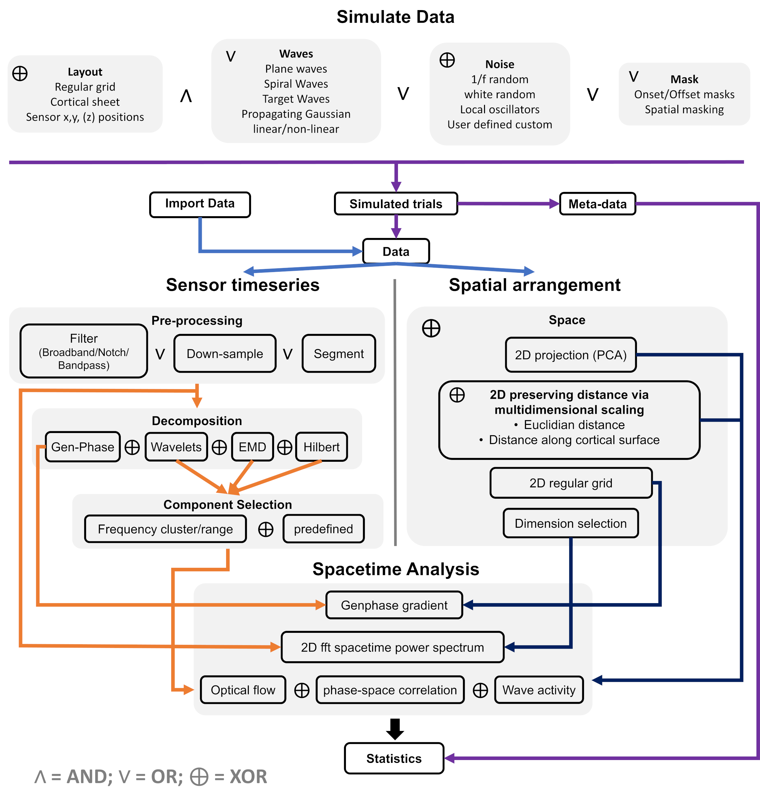

# WaveSpace
Python tools for the simulation and analysis of cortical traveling waves

## Installation

Download latest version from [here](https://github.com/kpetras/WaveSpace/tree/main/distribution)

Open a terminal, navigate to correct directory and install with
```
pip install WaveSpace-1.0.0-py3-none-any.whl
```
## Modules
### Decomposition: 
Implements various frequency decomposition techniques, such as Fourier and wavelet transforms, Empirical Mode Decomposition (EMD)

### Preprocessing:
Provides functions for cleaning, normalizing, and filtering time series data.

### Plotting Helpers: 
Contains utilities for visualizing cortical traveling waves using matplotlib & pyvista, including time-frequency plots, phase maps, and spatial-temporal representations.

### Simulation: 
Tools for generating synthetic cortical traveling waves, aiding in model validation and hypothesis testing.

### Spatial Arrangement:
Handles spatial organization of sensor positions. Includes interpolation options

### Statistics:
Offers methods for computing null distributions.

### Utils:
A collection of general-purpose helper functions used throughout the toolbox, including data manipulation and file I/O.
#### The `WaveData` Class

The `WaveData` class serves as a container for time-series data related to cortical traveling waves. It provides functionalities for data storage, manipulation, and analysis, ensuring a structured workflow for handling multi-channel neural recordings. 

##### **Key Features**
- **Initialization (`__init__`)**: Stores channel positions, time vectors, sample rates, and maintains a structured dataset with multiple *DataBuckets* for flexible data handling.
- **Data Management**:
  - Supports multiple datasets through *DataBuckets*, enabling users to store, retrieve, and manipulate data flexibly.
  - Provides methods to add, delete, and check the existence of specific *DataBuckets*.
  - Allows appending datasets and setting an active dataset for streamlined analysis.
- **Data Processing**:
  - **Cropping**: Enables temporal cropping of data using specific time intervals.
  - **Trial Pruning**: Removes unwanted trials from datasets while maintaining metadata consistency.
- **Metadata Handling**:
  - Stores and retrieves spatial arrangements of recording channels (`set_channel_positions`, `get_channel_positions`).
  - Maintains a history of operations for reproducibility (`log_history`).
  - Supports storage and retrieval of simulation and trial metadata (`set_simInfo`, `get_trialInfo`).
- **I/O and Persistence**:
  - Saves objects to files for later retrieval (`save_to_file`).
  - Provides a structured string representation (`__repr__`) for quick dataset summaries.

This class is essential for organizing and processing large-scale neural recordings, offering flexibility in data structuring, preprocessing, and visualization. Let me know if you’d like any refinements!

### Wave Analysis: 
Core module for detecting, characterizing, and quantifying cortical traveling waves using advanced signal processing techniques.



# Example:
```
from WaveSpace.Simulation import SimulationFuns
from WaveSpace.PlottingHelpers import Plotting
from WaveSpace.Utils import HelperFuns as hf

import numpy as np
import matplotlib.pyplot as plt

Type =  "PlaneWave" 
nTrials = 1
matrixSize = 20
SampleRate= 128
SimDuration= 1.0

waveData = SimulationFuns.simulate_signal(
    Type, 
    nTrials, 
    matrixSize, 
    SampleRate, 
    SimDuration, 
    #SimOptions from here on
    TemporalFrequency = 10,
    SpatialFrequency = 0.7,
    WaveDirection = 45,
    )

hf.squareSpatialPositions(waveData)
ani = Plotting.animate_grid_data(waveData, DataBucketName="SimulatedData", dataInd=0, 
                                 probepositions=[(4,7), (8,7), (12,7), (16,7)])
ani.save('PlaneWave.mp4', writer='ffmpeg', fps=6)
```

